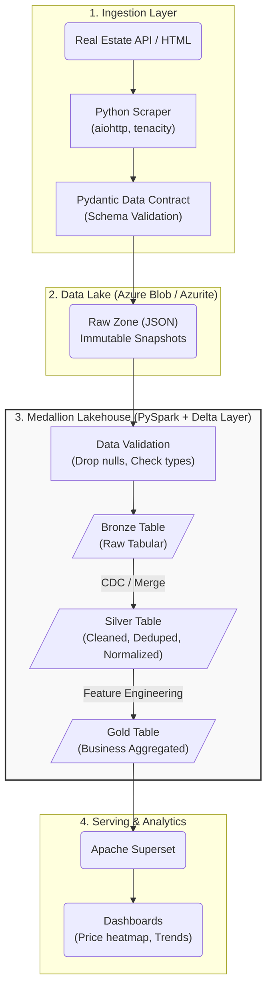

# 🏙️ Real Estate Data Platform – End-to-End Data Pipeline


## 1. 🎯 Tổng quan dự án (Project Overview)
Dự án xây dựng một hệ thống **Data Pipeline toàn diện (End-to-End)** thu thập, xử lý và phân tích dữ liệu Bất động sản.
Hệ thống được thiết kế theo tư tưởng **Modern Data Stack**, tuân thủ kiến trúc **Medallion Architecture (Bronze - Silver - Gold)** trên nền tảng **Lakehouse**.

Mục tiêu thiết kế hướng tới **Sẵn sàng cho Production (Production-ready)**:
- 🔄 **Idempotent & Replay-safe**: Chạy lại pipeline nhiều lần không lo trùng lặp dữ liệu.
- ⚙️ **Config-driven**: Mọi môi trường được điều khiển tập trung qua `YAML` và `.env`, logic code hoàn toàn tách biệt.
- 🧩 **Scalability**: Sử dụng Distributed computing với PySpark, có khả năng scale logic từ Local lên Cloud dễ dàng với dung lượng lưu trữ lớn.
- 🛡️ **Data Contracts**: Schema validation nghiêm ngặt ngay từ nguồn vào để chặn đứng dữ liệu rác (Garbage-In, Garbage-Out).

---

## 2. 🛠️ Kiến trúc và Công nghệ (Tech Stack)

### Sự lựa chọn Công nghệ (Why these tools?)
- **Apache Spark (PySpark)**: Distributed Processing Engine. Đóng vai trò làm sạch (cleaning), Deduplication (loại bỏ trùng lặp) và Feature Engineering song song. Hiệu năng tính toán phân tán cao hơn hẳn Pandas khi scale dữ liệu lớn.
- **Delta Lake**: Table Format chuẩn công nghiệp. Giải quyết nhược điểm của Data Lake truyền thống (Data Swamps) bằng cấu trúc ACID Transactions, hỗ trợ tính năng cập nhật (`MERGE/UPSERT`), Schema Evolution và Time Travel.
- **Dagster**: Orchestration Tool. Kế thừa và cải tiến khái niệm DAG của Airflow nhờ tư duy Software-Defined Assets (SDA) hiện đại, hỗ trợ quan sát trạng thái dòng chảy dữ liệu (Observability) trực quan.
- **Azurite (Azure Blob Storage Local)**: Abstraction layer cho Data Lake. Nguyên tắc cô lập hoàn toàn Storage và Compute. Cho phép test tính năng Object Storage ngay trên máy local trước khi mount kết nối lên Azure Cloud thật.
- **Pydantic**: Data Contracts. Dùng ở layer Ingestion để enforce cấu trúc API Payload ngay từ đầu nguồn.
- **Apache Superset**: Modern Data Exploration & BI platform. Giao diện mượt mà, trích xuất Dashboard trực tiếp từ tầng Gold Layer.
- **Docker Compose**: Containerization, cô lập môi trường chạy độc lập giúp project có thể chạy trực tiếp trên mọi môi trường.

---

## 3. 🌊 Luồng xử lý Dữ liệu (Data Flow)

Hệ thống triển khai luồng dữ liệu 4 mũi nhọn qua chuẩn **Medallion Architecture**:



### Chi tiết từng giai đoạn:

**Phase 1: Ingestion & Standardization (Raw Zone)**
- Hàm `fetch_raw_records`: Chịu trách nhiệm gọi API cào dữ liệu với thuật toán retry exponential backoff.
- Hàm `normalize_raw_record`: Dữ liệu lập tức đi qua **Pydantic Model** để chuẩn hóa thành cấu trúc `PropertyRecord` chung (Data Contracts). Cấu trúc sai lệch bị loại bỏ.
- Dữ liệu được ghi thẳng dưới dạng snapshot JSON immutable (chỉ thêm, không sửa xóa) xuống Prefix Raw của Azurite.

**Phase 2: Data Quality & Bronze Layer (Ingest to Lakehouse)**
- PySpark khởi tạo phân luồng, nạp raw file.
- Hàm `validate_records`: Tách nhánh luồng dữ liệu lỗi (thiếu field, sai format, sai logic số lượng) và nhánh dữ liệu chuẩn.
- Dữ liệu hợp lệ được ghi append vào bảng Delta **Bronze**.

**Phase 3: Transformation (Silver Layer)**
- PySpark transform làm sạch dữ liệu mạnh mẽ:
  - Text Normalization (Làm sạch khoảng trắng, chuẩn form Text).
  - Timezone alignment (Đồng bộ quy chiếu múi giờ).
  - **Deduplication**: Dùng `Window Function` partition phân bổ theo Business Key (`property_id`) để chọn bản ghi sự kiện muộn nhất (Latest log), loại trừ hoàn toàn dữ liệu trùng lặp.
- Dữ liệu hoàn thiện được đẩy thông qua cơ chế cập nhật **UPSERT (Delta Merge)**.

**Phase 4: Business Logic (Gold Layer)**
- Nạp dữ liệu vào từ tầng Silver. Thực hiện Data Modeling & Feature Engineering lập các cột giá trị kinh doanh:
  - Phân vùng giá kinh tế (`price_segment`: affordable, luxury).
  - Đơn giá trên mét vuông (`price_per_sqm`).
- Ghi **OVERWRITE** sang Gold Delta layer để tối ưu riêng cho Report.

**Phase 5: Consumption (BI & Downstream)**
- Nền tảng Superset kết nối với Gold Zone.
- Dashboard tự động trực quan hóa các chỉ số.

---

## 4. 🗂️ Danh sách Công cụ và Mapping Theo Module

### 4.1. Orchestration & Runtime (Điều phối)
| Tool | Vai trò | Vị trí Module |
|---|---|---|
| **Dagster** | Điều phối job, op, quản lý run lifecycle | `pipelines/definitions.py`, `jobs.py`, `ops/*.py` |
| **Dagster Webserver** | Giao diện theo dõi pipeline và trigger log | `docker-compose.yml` |
| **Docker Compose** | Đóng gói toàn bộ infrastructure nội bộ | `docker-compose.yml` |

### 4.2. Processing & Lakehouse (Xử lý tập trung)
| Tool | Vai trò | Vị trí Module |
|---|---|---|
| **PySpark** | Distributed Cleaning, Transform, Validation | `src/processing/*.py` |
| **Delta Lake** | ACID Storage format (Merge/Upsert) | `src/lakehouse/delta_writer.py` |
| **pandas/pyarrow** | Hỗ trợ phân tích dữ liệu memory nhẹ | `requirements.txt` |

### 4.3. Cloud Integration & Storage (Lưu trữ)
| Tool | Vai trò | Vị trí Module |
|---|---|---|
| **Azure Blob SDK** | Upload/Download/List phân vùng Object Storage | `src/storage/azure_client.py` |
| **Azurite** | Giả lập Azure Storage chạy offline (port 10000) | `docker-compose.yml` |

### 4.4. Ingestion & Quality (Thu thập & Chất lượng)
| Tool | Vai trò | Vị trí Module |
|---|---|---|
| **aiohttp / requests** | HTTP Client lấy dữ liệu Data Source | `src/scraper/client.py` |
| **tenacity** | Exponential Retry (Chống network fail) | `src/scraper/client.py` |
| **Pydantic** | Schema validation nghiêm ngặt (Data Contracts) | `src/scraper/normalizer.py` |

### 4.5. Config & Observability (Cấu hình hệ thống)
| Tool | Vai trò | Vị trí Module |
|---|---|---|
| **pydantic-settings** | Load biến môi trường & Settings Validation | `src/config.py` |
| **PyYAML** | Khai báo kiến trúc tuỳ chọn multi-environment | `pipelines/config/*.yaml` |
| **Logging** | Ghi nhận chi tiết flow hệ thống chạy | `src/logging_config.py` |

---

## 5. 📂 Cấu trúc Thư mục Lõi (Project Structure)

```text
├── src/                        # 🧠 Core Business Logic (Spark, Pydantic, SDK)
│   ├── scraper/                # Extraction logic (client, normalizer)
│   ├── processing/             # PySpark logic (cleaning, transform, validation)
│   ├── lakehouse/              # Delta writer (Merge/Upsert logic)
│   ├── storage/                # Cloud connectors (Azure Blob Storage)
│   ├── cdc/                    # Change Data Capture logic (Fingerprinting)
│   ├── models/                 # Chứa Data Contract Class `PropertyRecord`
│   └── config.py               # Dependency injection configs
│
├── pipelines/                  # ⚙️ Orchestration (Dagster Definitions)
│   ├── ops/                    # Các node xử lý độc lập (Ingestion, Processing)
│   ├── jobs.py                 # Chuỗi liên kết các Ops thành luồng Pipeline
│   └── resources.py            # Cấp phát Spark Session, Config Settings
│
├── pipelines/config/           # 📝 Files `.yaml` điều khiển cấu trúc Profile
├── docker/                     # 🐳 Các custom Image (Dagster daemon, Superset)
├── data/                       # 🗄️ Local Data (Mount thư mục lưu trữ Delta)
├── tests/                      # 🧪 Pytest (Unit tests layer)
└── workspace.yaml              # 📑 Entrypoint của Dagster UI
```

---

## 6. 🚀 Hướng dẫn Set up và Chạy thử (Local Runbook)

### Bước 1: Khởi tạo biến môi trường
Mở Terminal, chạy lệnh tạo file `.env` từ file mẫu:
```bash
cp .env.example .env
```

### Bước 2: Tải Dependency Python
Tạo môi trường ảo (Tùy chọn) và cài đặt thư viện:
```bash
pip install -r requirements.txt
```

### Bước 3: Khởi động Data Infrastructure (Docker)
```bash
docker-compose up -d --build
```
> Lúc này 3 dịch vụ sẽ chạy ngầm:
> - `real-estate-azurite`: Node Storage (Port 10000)
> - `real-estate-dagster-web`: Node Orchestrator (Port 3000)
> - `real-estate-superset`: Node Explorer (Port 8088)

### Bước 4: Chạy Pipeline End-to-End
1. Truy cập **Dagster UI**: `http://localhost:3000`
2. Vào màn hình **Jobs** -> Nhấp vào **`ingestion_job`** -> Nhấn **Materialize**. 
   *(Hệ thống sẽ chạy Data Contracts scrape raw records xuống Azurite).*
3. Sau khi chạy xong thành công, quay lại màn hình **Jobs** -> Nhấp vào **`processing_job`** -> Nhấn **Materialize**.
   *(PySpark sẽ nạp Raw -> Bronze -> Silver -> Gold).*
4. Theo dõi trực tiếp đường đi của dữ liệu qua giao diện Graph.

### Bước 5: Xem báo cáo trên Dashboard
1. Truy cập **Superset**: `http://localhost:8088` (Tài khoản: `admin` / Mật khẩu: `admin`)
2. Tại đây Dataset Gold Layer đã sẵn sàng, bạn hoàn toàn có thể xuất Dashboard theo dõi.

---

## 7. 🌟 Giá trị dự án & Roadmap tương lai

Dự án phản ánh trực tiếp nguyên tắc hoạt động của Big Data Engineering thực chiến:
1. Không code cứng logic hạ tầng: Hệ thống linh hoạt tự bẻ lái theo config `.yaml` profile.
2. Tách bạch Data Layers rõ rệt theo chuẩn Medallion.
3. Không lo lặp dữ liệu nhờ Deduplication Windows Function bằng Spark.

**Roadmap bổ sung sắp tới (Phase 1):**
- Thêm cơ chế ghi nhận State Persistence cho CDC vào Blob Storage.
- Cài đặt Dead Letter Queue (DLQ) cho dữ liệu hỏng.
- Tích hợp luồng cảnh báo tự động qua Slack khi Pipeline Fail.
- Xây dựng Reconciliation Ops (Kiểm soát chất lượng bằng Row Count tự động).
- `src/scraper/client.py`
- `src/scraper/normalizer.py`
- `src/storage/raw_storage.py`

Bắt buộc có:
- Retry exponential backoff.
- Timeout + exception handling.
- Lưu snapshot raw bất biến.

Kiểm thử tối thiểu:
- Lỗi mạng tạm thời vẫn retry đúng số lần.
- Payload sai định dạng không làm sập pipeline.

### Bước 5 - Triển khai CDC

Thực hiện tại:
- `src/cdc/fingerprint.py`
- `src/cdc/state_store.py`

Bắt buộc có:
- Fingerprint ổn định.
- Chỉ phát sinh record mới/thay đổi.
- Lưu state sau mỗi run thành công.

Kiểm thử tối thiểu:
- Chạy lại cùng input không tạo dữ liệu mới.
- Đổi `price` thì record được nhận diện updated.

### Bước 6 - Triển khai processing + validation

Thực hiện tại:
- `src/processing/validation.py`
- `src/processing/cleaning.py`
- `src/processing/transform.py`

Bắt buộc có:
- Required-field checks.
- Numeric constraints.
- Chuẩn hóa kiểu dữ liệu và naming.
- Idempotent transformation.

Kiểm thử tối thiểu:
- Cùng input chạy nhiều lần vẫn cho output giống nhau.

### Bước 7 - Triển khai Delta lakehouse

Thực hiện tại:
- `src/lakehouse/delta_writer.py`

Bắt buộc có:
- Merge/upsert cho bronze và silver.
- Overwrite có kiểm soát cho gold.
- Chính sách schema evolution rõ ràng.

Kiểm thử tối thiểu:
- Re-run cùng batch không tạo duplicate.

### Bước 8 - Triển khai Dagster orchestration

Thực hiện tại:
- `pipelines/resources.py`
- `pipelines/ops/*.py`
- `pipelines/jobs.py`
- `pipelines/definitions.py`

Bắt buộc có:
- Dependency rõ ràng giữa các op.
- Logging có context từng op.
- Retry policy cho các bước gọi external.

Kiểm thử tối thiểu:
- Trigger được một run thành công từ Dagster UI.
- Có thể rerun an toàn.

### Bước 9 - Triển khai analytics + notebooks (tùy chọn)

Thực hiện tại:
- `src/analytics/aggregations.py`
- `notebooks/` (chạy qua Papermill nếu cần)

Bắt buộc có:
- Dataset xu hướng giá theo thời gian.
- Dataset so sánh theo thành phố/quận.

### Bước 10 - Xây dashboard Superset

Bắt buộc có:
- Dashboard xu hướng giá.
- Dashboard so sánh khu vực.
- Bộ lọc theo city, district, khoảng thời gian.

### Bước 11 - Hardening trước production

Bắt buộc có:
- Alert khi pipeline fail.
- Quản lý secrets an toàn (không dùng default credentials).
- Data retention policy cho raw/bronze/silver/gold.
- Theo dõi chi phí và hiệu năng.

## 9) Cấu hình mẫu `.env`

Lấy `.env.example` làm chuẩn.

Với local Azurite:
```env
AZURE_ENDPOINT=http://127.0.0.1:10000/devstoreaccount1
AZURE_STORAGE_ACCOUNT=devstoreaccount1
AZURE_STORAGE_KEY=Eby8vd...
AZURE_CONTAINER=real-estate-platform
```

## 10) Chuyển Azurite sang Azure Data Lake (không đổi core logic)

Chỉ cần đổi biến môi trường:
- Đặt `APP_PROFILE=local.azure`.
- Để trống `AZURE_ENDPOINT=`.
- Đặt `AZURE_STORAGE_ACCOUNT` và `AZURE_STORAGE_KEY` theo Azure Tenant của bạn.
- Đặt `AZURE_CONTAINER` theo container thực tế.
- Cloud Authentication qua Connection String và adlfs/hadoop-azure.

Nguyên tắc:
- Toàn bộ module chỉ gọi qua interface storage abstraction.
- Không hardcode endpoint ở nơi khác ngoài config.

## 11) Lý do thiết kế (design decisions)

- Dùng CDC fingerprint để giảm chi phí, tránh duplicate.
- Tách raw/bronze/silver/gold để dễ audit, replay, truy vết.
- Dùng Dagster để quản trị dependency và quan sát vận hành.
- Dùng Superset để dashboard nhanh, phù hợp bài toán BI.

## 12) Hướng cải tiến tương lai

- Thêm contract testing cho API nguồn.
- Thêm framework data quality (ví dụ Great Expectations).
- Thêm unit/integration tests và CI/CD.
- Thêm lineage metadata (OpenLineage).
- Thêm data catalog và ownership model.

## 13) Bộ câu hỏi phỏng vấn mẫu

1. Vì sao cần raw immutable layer?
- Để audit, replay và debug mà không mất dữ liệu gốc.

2. CDC fingerprint giải quyết vấn đề gì?
- Tránh full reload, giảm tài nguyên, giữ idempotency.

3. Làm sao migrate Azurite sang Azure Data Lake mà không đổi code lõi?
- Dùng storage abstraction, chỉ thay biến môi trường. SparkSession cũng được config tự động lấy credentials Cloud thay vì endpoint devstore.

4. Vì sao cần tách bronze/silver/gold?
- Mỗi layer có mục tiêu khác nhau: ingest, curate, serve BI.

5. Idempotency quan trọng như thế nào?
- Có thể rerun sau lỗi mà không làm sai dữ liệu hay KPI.

6. Nếu source API thay đổi schema đột ngột thì xử lý sao?
- Thêm validation và route bản ghi lỗi vào quarantine.

## 14) Kế hoạch tiếp theo đề xuất

Theo đúng thứ tự để hạn chế rủi ro:
1. Hoàn thiện ingestion thật từ scraper vào raw storage.
2. Ghép `pipelines/resources.py`, `pipelines/jobs.py` và `pipelines/definitions.py` cho Dagster.
3. Hoàn thiện CDC + processing + Delta Lake.
4. Nối analytics và dashboard Superset.
