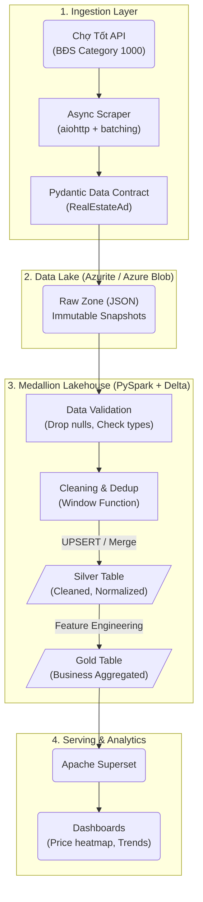

# 🏙️ Real Estate Data Platform – End-to-End Data Pipeline


## 1. 🎯 Tổng quan dự án (Project Overview)
Dự án xây dựng một hệ thống **Data Pipeline toàn diện (End-to-End)** thu thập, xử lý và phân tích dữ liệu **Bất Động Sản** từ API Chợ Tốt.
Hệ thống được thiết kế theo tư tưởng **Modern Data Stack**, tuân thủ kiến trúc **Medallion Architecture (Bronze → Silver → Gold)** trên nền tảng **Lakehouse**.

Mục tiêu thiết kế hướng tới **Sẵn sàng cho Production (Production-ready)**:
- 🔄 **Idempotent & Replay-safe**: Chạy lại pipeline nhiều lần không lo trùng lặp dữ liệu.
- ⚙️ **Config-driven**: Mọi môi trường được điều khiển tập trung qua `YAML` và `.env`, logic code hoàn toàn tách biệt.
- 🧩 **Scalability**: Sử dụng Distributed computing với PySpark, có khả năng scale logic từ Local lên Cloud dễ dàng.
- 🛡️ **Data Contracts**: Schema validation nghiêm ngặt ngay từ nguồn vào (Pydantic) để chặn đứng dữ liệu rác.

---

## 2. 🛠️ Kiến trúc và Công nghệ (Tech Stack)

| Tool | Vai trò | Lý do chọn |
|------|---------|------------|
| **PySpark** | Distributed Processing Engine | Cleaning, Deduplication, Feature Engineering phân tán. Hiệu năng hơn Pandas khi scale. |
| **Delta Lake** | ACID Table Format | MERGE/UPSERT, Schema Evolution, Time Travel. Giải quyết Data Swamp. |
| **Dagster** | Orchestration | Software-Defined Assets, Observability trực quan hơn Airflow. |
| **Azurite** | Azure Blob Storage Local | Test Object Storage offline trước khi deploy lên Azure Cloud. |
| **Pydantic** | Data Contracts | Enforce API payload schema ngay ingestion layer. |
| **Superset** | BI & Dashboard | Trực quan hóa Gold Layer, dashboard real-time. |
| **Docker Compose** | Containerization | Chạy toàn bộ infrastructure trên mọi máy. |
| **aiohttp** | Async HTTP Client | Cào dữ liệu bất đồng bộ, nhanh hơn requests đồng bộ. |
| **tenacity** | Retry Logic | Exponential backoff chống network failure. |

---

## 3. 🌊 Luồng xử lý Dữ liệu (Data Flow)

Hệ thống triển khai luồng dữ liệu qua chuẩn **Medallion Architecture**:



### Chi tiết từng giai đoạn:

**Phase 1: Ingestion & Standardization (Raw Zone)**
- `fetch_raw_records()`: Cào dữ liệu BĐS qua API với async batching + semaphore anti-ban.
- `normalize_raw_record()`: Validate qua **Pydantic RealEstateAd** model, chuẩn hóa schema.
- Ghi snapshot JSON immutable xuống Azurite Raw Zone.

**Phase 2: Data Quality & Validation**
- PySpark nạp raw file, tách nhánh valid/invalid records.
- Ghi quality report cho monitoring health.

**Phase 3: Transformation (Silver Layer)**
- Text Normalization, Timezone alignment.
- **Deduplication**: Window Function partition theo `property_id`.
- Feature Engineering: `price_segment`, `area_segment`, `price_per_sqm`.
- **UPSERT** vào Delta Silver table.

**Phase 4: Business Analytics (Gold Layer)**
- Group By city/district + Aggregation (avg, median, p90 price).
- **OVERWRITE** sang Delta Gold layer.

**Phase 5: Consumption (BI & Dashboard)**
- Superset kết nối Gold Zone qua DuckDB engine.

---

## 4. 📂 Cấu trúc Thư mục (Project Structure)

```text
├── src/                        # 🧠 Core Business Logic
│   ├── config.py               # Config-driven settings (YAML + .env)
│   ├── logging_config.py       # Centralized logging
│   ├── scraper/                # API scraping (async client, Pydantic normalizer)
│   ├── processing/             # PySpark logic (cleaning, transform, validation)
│   ├── lakehouse/              # Delta writer (Merge/Upsert/Overwrite)
│   └── storage/                # Azure Blob / Azurite client
│
├── pipelines/                  # ⚙️ Dagster Orchestration
│   ├── definitions.py          # Dagster Definitions entrypoint
│   ├── jobs.py                 # ingestion_job + processing_job
│   ├── resources.py            # Settings, Storage, Spark resources
│   ├── config/                 # Profile YAML configs
│   │   ├── base.yaml           # Shared base config
│   │   ├── local.yaml          # Local Azurite profile
│   │   └── local.azure.yaml    # Azure Cloud profile
│   └── ops/                    # Dagster ops (ingestion, processing)
│
├── docker/                     # 🐳 Custom Docker images
│   ├── dagster/Dockerfile
│   └── superset/Dockerfile
│
├── tests/                      # 🧪 Unit tests (PySpark)
├── scripts/                    # 🔧 Utility scripts
├── data/                       # 🗄️ Local Delta tables output
├── .env                        # 🔐 Environment secrets
├── .env.example                # 📋 Template
├── docker-compose.yml          # 🐳 Infrastructure
├── requirements.txt            # 📦 Dependencies
└── workspace.yaml              # 📑 Dagster entrypoint
```

---

## 5. 🚀 Hướng dẫn Set up và Chạy thử (Local Runbook)

### Bước 1: Khởi tạo biến môi trường
```bash
cp .env.example .env
```

### Bước 2: Tải Dependency Python
```bash
pip install -r requirements.txt
```

### Bước 3: Khởi động Infrastructure (Docker)
```bash
docker-compose up -d --build
```
> Lúc này 4 dịch vụ sẽ chạy:
> - `real-estate-azurite`: Storage (Port 10000)
> - `real-estate-dagster-web`: Orchestrator UI (Port 3000)
> - `real-estate-dagster-daemon`: Background scheduler
> - `real-estate-superset`: BI Dashboard (Port 8088)

### Bước 4: Chạy Pipeline End-to-End
1. Truy cập **Dagster UI**: `http://localhost:3000`
2. Vào **Jobs** → **`ingestion_job`** → **Materialize**
   *(Scrape BĐS → Normalize → Store RAW)*
3. Sau khi xong, chạy **`processing_job`** → **Materialize**
   *(Validate → Clean → Silver → Gold)*

### Bước 5: Xem Dashboard
1. Truy cập **Superset**: `http://localhost:8088` (`admin`/`admin`)
2. Kết nối Gold Layer để tạo Dashboard.

---

## 6. ⚙️ Cấu hình Config-Driven

### Thứ tự ưu tiên nạp config:
1. `pipelines/config/base.yaml` (shared defaults)
2. `pipelines/config/{APP_PROFILE}.yaml` (profile override)
3. `.env` (environment variable override)

### Chuyển Azurite → Azure Cloud:
Chỉ cần đổi biến môi trường, **không đổi code**:
```env
APP_PROFILE=local.azure
AZURE_ENDPOINT=
AZURE_STORAGE_ACCOUNT=your_real_account
AZURE_STORAGE_KEY=your_real_key
AZURE_CONTAINER=your_container
```

### Variables trong `.env`:
| Variable | Mô tả | Default |
|----------|--------|---------|
| `APP_PROFILE` | Profile YAML để load | `local` |
| `MAX_PAGES` | Số trang API cào | `50` |
| `PAGES_PER_BATCH` | Trang/batch (anti-ban) | `5` |
| `BATCH_DELAY_SECONDS` | Delay giữa batch | `2.0` |
| `SEMAPHORE_SIZE` | Max concurrent requests | `3` |
| `AZURE_ENDPOINT` | Azurite endpoint (để trống = Cloud) | `http://127.0.0.1:10000/...` |

---

## 7. 🌟 Lý do thiết kế (Design Decisions)

- **Raw immutable layer**: Audit, replay và debug mà không mất dữ liệu gốc.
- **Medallion Architecture**: Tách bạch ingest → curate → serve BI.
- **Deduplication via Window Function**: Chạy lại cùng input không tạo duplicate.
- **Config-driven**: Chuyển local ↔ cloud chỉ đổi `.env`, không sửa business logic.
- **Storage abstraction**: Toàn bộ module gọi qua `AzureStorageClient` interface.

---

## 8. 🔮 Roadmap tương lai

- [ ] CDC fingerprint cho incremental processing
- [ ] Dead Letter Queue (DLQ) cho dữ liệu hỏng
- [ ] Alert tự động qua Slack khi pipeline fail
- [ ] Reconciliation Ops (Row count validation)
- [ ] Data quality framework (Great Expectations)
- [ ] Unit/Integration tests mở rộng + CI/CD
- [ ] Lineage metadata (OpenLineage)
