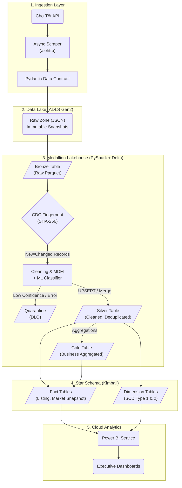

# 🏙️ Real Estate Data Platform – End-to-End Data Pipeline

*(Khu vực dành cho hình ảnh Dashboard của bạn. Hãy chụp màn hình Power BI, lưu vào thư mục `docs/images/` với tên `powerbi_dashboard.png`)*


## 1. 🎯 Tổng quan dự án (Project Overview)
Dự án xây dựng một hệ thống **Data Platform toàn diện (End-to-End)** thu thập, xử lý và phân tích dữ liệu **Bất Động Sản** từ API.
Hệ thống được thiết kế theo tư tưởng **Modern Data Stack**, tuân thủ kiến trúc **Medallion Architecture (Bronze → Silver → Gold → Warehouse)** trên nền tảng **Lakehouse**.

Mục tiêu thiết kế hướng tới **Sẵn sàng cho Production (Production-ready)**:
- 🔄 **Idempotent & Replay-safe**: Chạy lại pipeline nhiều lần không lo trùng lặp dữ liệu, tích hợp cơ chế **CDC (Change Data Capture)**.
- ⚙️ **Config-driven**: Điều khiển tập trung qua `YAML` và `.env`, logic code hoàn toàn tách biệt. Chuyển đổi Local ↔ Azure Cloud mượt mà.
- 🧠 **Hybrid ML Classification & DLQ**: Kết hợp Rule-based (Regex) và Machine Learning (XGBoost & Random Forest) để phân loại BĐS. Các dữ liệu "dị thường" tự động đẩy vào vùng cách ly Quarantine (Dead Letter Queue).
- 🧩 **Scalability**: Xử lý phân tán với PySpark, scale dễ dàng lên **Azure Databricks**.
- 📊 **Cloud-to-Cloud BI**: Tích hợp trực tiếp từ Azure Data Lake lên Power BI Service với cơ chế tự động làm mới (Scheduled Refresh).

---

## 2. 🛠️ Kiến trúc và Công nghệ (Tech Stack)

| Tool | Vai trò | Lý do chọn |
|------|---------|------------|
| **PySpark** | Distributed Processing Engine | Cleaning, Deduplication, Feature Engineering phân tán. Hiệu năng vượt trội khi scale up. |
| **Delta Lake** | ACID Table Format | MERGE/UPSERT, Schema Evolution, Time Travel. Giải quyết triệt để Data Swamp. |
| **Dagster** | Orchestration | Software-Defined Assets, Observability trực quan, type-safe. |
| **Azure ADLS Gen2** | Object Storage (Data Lake) | Lưu trữ toàn bộ data Lakehouse. Kích hoạt Hierarchical Namespace tối ưu cho Big Data. |
| **Azure Databricks**| Cloud Compute | Chạy các cụm xử lý ETL phân tán thông qua Databricks Connect. |
| **Scikit-learn & XGBoost** | Machine Learning | Ứng dụng các mô hình XGBoost và Random Forest để phân loại loại hình BĐS thông minh. |
| **Power BI Service** | Cloud BI & Dashboard | Trực quan hóa dữ liệu tự động, Scheduled Refresh không cần cài đặt Gateway trung gian. |
| **Docker Compose** | Containerization | Đóng gói và chạy toàn bộ hạ tầng (Dagster, Superset local) đồng nhất. |

---

## 3. 🌊 Luồng xử lý Dữ liệu (Data Flow)

Hệ thống triển khai luồng dữ liệu qua chuẩn **Medallion Architecture** mở rộng:



### Chi tiết từng giai đoạn:

**Phase 1: Ingestion & Standardization (Raw Zone)**
- Thu thập dữ liệu API với cơ chế async batching + semaphore chống ban. Validate tính toàn vẹn dữ liệu qua **Pydantic** model.

**Phase 2: CDC & Data Quality (Bronze Layer)**
- **CDC Fingerprinting**: Tính mã băm SHA-256 để so sánh trạng thái, chỉ xuất ra những bản ghi mới hoặc có thay đổi thực sự nhằm tối ưu chi phí tính toán (Compute Cost).

**Phase 3: Transformation & Machine Learning (Silver Layer)**
- **Hybrid Classification**: Phân loại thuộc tính BĐS qua 2 lớp (Tập luật Regex → Mô hình Machine Learning: XGBoost & Random Forest).
- **Data Quarantine (DLQ)**: Bản ghi rác hoặc không nhận diện được sẽ bị đẩy vào vùng cách ly để kỹ sư review thay vì làm hỏng dữ liệu sạch.
- **Deduplication**: Xóa bỏ các tin đăng trùng lặp bằng Window Function.
- **UPSERT** (MERGE) vào Delta Silver table đảm bảo tính Idempotency.

**Phase 4: Business Analytics (Gold Layer)**
- Tính toán các chỉ số kinh doanh tổng hợp theo chiều không gian và thời gian.

**Phase 5: Star Schema Warehouse (Data Modeling)**
- Ứng dụng mô hình **Kimball**. Trích xuất dữ liệu thành các bảng **Dimension** và **Fact**.
- Xử lý các thay đổi theo thời gian bằng kỹ thuật **Slowly Changing Dimensions (SCD Type 1 & Type 2)**.

**Phase 6: Consumption (BI & Cloud Delivery)**
- Đẩy toàn bộ mô hình ngữ nghĩa lên **Power BI Service**.
- Xác thực với Cloud thông qua **Azure Account Key** và cấu hình **Scheduled Refresh**, tạo thành một luồng dữ liệu tự động 100%.

---

## 4. 🚀 Hướng dẫn Triển khai Lên Cloud (Azure Deployment)

Hệ thống được thiết kế **Cloud-Native**, hỗ trợ chuyển đổi từ Local sang Azure Cloud chỉ bằng việc đổi profile config trong file `YAML/.env`:

- **Storage**: Chuyển từ hạ tầng cục bộ sang **Azure Data Lake Storage Gen2 (ADLS)**.
- **Compute**: PySpark chạy trực tiếp trên **Azure Databricks**.

**Cách cấu hình chạy Cloud**:
Thiết lập file `.env.cloud`:
```env
APP_PROFILE=local.azure
AZURE_ENDPOINT=  # Trống để kích hoạt Cloud SDK
AZURE_STORAGE_ACCOUNT=strealestatedatalake
AZURE_STORAGE_KEY=your_azure_access_key
AZURE_CONTAINER=datalake
DATABRICKS_HOST=https://adb-xxx.azuredatabricks.net/
DATABRICKS_TOKEN=your_token
```
*(Code Python sẽ tự động phát hiện profile `local.azure` và sử dụng đường dẫn `abfss://` để tương tác trực tiếp với Cloud Storage).*

---

## 5. 🌟 Bảng Tóm tắt Điểm Nổi bật (Technical Highlights for CV)

- ☁️ **Cloud Architecture**: Thiết lập và vận hành ADLS Gen2, kết nối hạ tầng tính toán Databricks Connect.
- 🔍 **CDC Fingerprinting**: Cơ chế bắt thay đổi dữ liệu cực kỳ tối ưu bằng mã băm SHA-256, giảm thiểu tải xử lý dư thừa cho hệ thống.
- 🤖 **Hybrid ML & Data Quarantine (DLQ)**: Pipeline không sụp đổ khi dữ liệu rác xuất hiện; model AI dự đoán phân loại nhà và DLQ gom dữ liệu dị thường.
- 🏗️ **Kimball Star Schema & SCD**: Thiết kế cấu trúc dữ liệu Data Warehouse vững chắc chuẩn ngành, xử lý cập nhật lịch sử thông minh (SCD 1 & 2).
- 📊 **Cloud-to-Cloud BI**: Tự động hóa toàn bộ quá trình lên báo cáo với Power BI Service mà không phụ thuộc vào hạ tầng trung gian On-premise.
