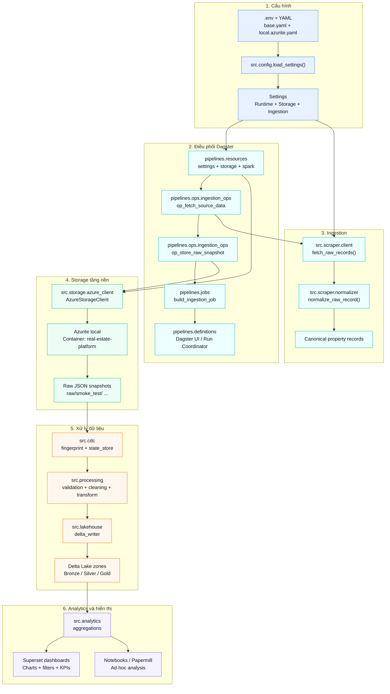

# Real Estate Data Platform - End-to-End Data Pipeline

## 1) Mục tiêu dự án

Dự án này xây dựng một pipeline dữ liệu bất động sản theo chuỗi:

Ingestion -> Raw Storage -> CDC -> Processing -> Lakehouse -> Analytics -> Visualization

Mục tiêu thiết kế:
- Hướng production nhưng vẫn đủ nhẹ để chạy local trên máy cá nhân.
- Tách lớp rõ ràng, dễ kiểm thử, dễ thay storage backend từ Azurite sang ADLS Gen2.
- Ưu tiên idempotency, replay-safe và cấu hình hóa bằng YAML/.env.

## 2) Trạng thái hiện tại

Repo hiện đã chuyển sang stack Azure/Azurite + PySpark + Delta Lake.

Đã hoàn thành và kiểm chứng:
- `src/config.py` đọc cấu hình theo profile YAML và environment variables.
- `src/storage/azure_client.py` kết nối được Azurite, tự tạo container, ghi và đọc blob.
- Smoke test `scripts/test_azure_connection.py` chạy thành công end-to-end với container `real-estate-platform`.
- `pipelines/config/local.azurite.yaml` và `.env.example` đã trỏ đúng `127.0.0.1` cho local development.

Đang ở giai đoạn tiếp theo:
- Nối ingestion thật từ scraper vào storage abstraction.
- Hoàn thiện Dagster resources, ops và job definitions để chạy pipeline thay vì chỉ smoke test.

## 3) Sơ đồ toàn bộ luồng hoạt động



### Ý nghĩa sơ đồ

- Khối 1 cho thấy toàn bộ hệ thống bắt đầu từ `.env` và YAML.
- Khối 2 cho thấy Dagster nhận settings, gắn resources và điều phối ingestion job.
- Khối 3 cho thấy scraper lấy dữ liệu nguồn rồi chuẩn hóa về schema chung.
- Khối 4 cho thấy storage abstraction chỉ nói chuyện với Azurite hoặc ADLS.
- Khối 5 cho thấy dữ liệu raw đi qua CDC, processing và Delta Lake để sinh bronze/silver/gold.
- Khối 6 cho thấy dữ liệu phục vụ analytics, dashboard Superset và notebook phân tích.

## 4) Kết quả cuối cùng đã xác nhận

Milestone hiện tại đã được xác nhận bằng smoke test:
- Tạo container `real-estate-platform` thành công.
- Ghi blob `raw/smoke_test/test_file.json` thành công.
- Đọc lại danh sách blob bằng `list_keys()` thành công.

Nghĩa là tầng nền của hệ thống đã sẵn sàng để nối ingestion thật.

## 5) Kiến trúc tổng thể

### 5.1 Luồng nghiệp vụ

1. Ingestion
- Lấy dữ liệu từ API hoặc nguồn scrape.
- Có retry, timeout và xử lý lỗi.

2. Raw Storage
- Lưu payload gốc vào Azurite khi chạy local, sau đó chuyển sang ADLS Gen2.
- Lưu theo snapshot bất biến để audit và replay.

3. CDC
- Tính fingerprint để phát hiện record mới hoặc record thay đổi.

4. Processing
- Validate dữ liệu bắt buộc.
- Làm sạch, chuẩn hóa field.
- Tạo dữ liệu sẵn sàng cho analytics.

5. Lakehouse
- Upsert vào bronze/silver bằng Delta Lake.
- Tạo gold dataset phục vụ BI.

6. Orchestration
- Dùng Dagster để định nghĩa jobs, ops và dependency.
- Gắn logging, retry và metadata cho từng run.

7. Analytics
- Tạo các bộ dữ liệu tổng hợp cho BI.
- Có thể chạy notebook qua Papermill khi cần.

8. Visualization
- Dùng Superset để xây dashboard giá, khu vực và xu hướng.

### 5.2 Stack local
- Azurite: object storage giả lập Azure Blob Storage.
- Dagster: orchestration + monitoring.
- Apache Spark (PySpark): xử lý dữ liệu lớn và giới hạn RAM khi chạy local.
- Delta Lake: lưu trữ ACID cho bronze/silver/gold.
- Superset: BI và dashboard.

## 6) Cấu trúc thư mục dự án

```text
Real Estate Data Platform – End-to-End Data Pipeline/
|-- .env.example
|-- .gitignore
|-- docker-compose.yml
|-- requirements.txt
|-- workspace.yaml
|-- README.md
|-- data/
|-- docker/
|   |-- dagster/
|   |   `-- Dockerfile
|   `-- superset/
|       `-- superset_config.py
|-- docs/
|   `-- pre_build_assessment.md
|-- notebooks/
|   `-- README.md
|-- pipelines/
|   |-- __init__.py
|   |-- definitions.py
|   |-- jobs.py
|   |-- resources.py
|   |-- config/
|   |   `-- README.md
|   `-- ops/
|       |-- __init__.py
|       |-- ingestion_ops.py
|       |-- cdc_ops.py
|       |-- processing_ops.py
|       `-- analytics_ops.py
|-- scripts/
|   `-- README.md
`-- src/
    |-- __init__.py
    |-- config.py
    |-- logging_config.py
    |-- models/
    |   `-- property.py
    |-- scraper/
    |   |-- __init__.py
    |   |-- client.py
    |   `-- normalizer.py
    |-- storage/
    |   |-- __init__.py
    |   |-- azure_client.py
    |   `-- raw_storage.py
    |-- cdc/
    |   |-- __init__.py
    |   |-- fingerprint.py
    |   `-- state_store.py
    |-- processing/
    |   |-- __init__.py
    |   |-- validation.py
    |   |-- cleaning.py
    |   `-- transform.py
    |-- lakehouse/
    |   |-- __init__.py
    |   `-- delta_writer.py
    `-- analytics/
        |-- __init__.py
        `-- aggregations.py
```

## 7) Vai trò từng file Python (để nắm luồng)

### 7.1 Nhóm core
- `src/config.py`: contract cấu hình môi trường.
- `src/logging_config.py`: chuẩn hóa logging cho toàn bộ pipeline.
- `src/models/property.py`: schema chuẩn của record bất động sản.

### 7.2 Nhóm ingestion + raw
- `src/scraper/client.py`: lấy dữ liệu nguồn, retry, xử lý lỗi.
- `src/scraper/normalizer.py`: chuẩn hóa payload về schema chung.
- `src/storage/azure_client.py`: abstraction đọc/ghi thư mục (Azurite hoặc ADLS).
- `src/storage/raw_storage.py`: tạo key partition và lưu snapshot raw.

### 7.3 Nhóm CDC
- `src/cdc/fingerprint.py`: tính fingerprint, phát hiện thay đổi.
- `src/cdc/state_store.py`: lưu/đọc state fingerprint giữa các lần chạy.

### 7.4 Nhóm processing + lakehouse
- `src/processing/validation.py`: kiểm tra chất lượng dữ liệu.
- `src/processing/cleaning.py`: làm sạch và chuẩn hóa giá trị.
- `src/processing/transform.py`: tạo dữ liệu silver/gold.
- `src/lakehouse/delta_writer.py`: ghi/upsert Delta Lake.

### 7.5 Nhóm analytics
- `src/analytics/aggregations.py`: tính toán dataset tổng hợp phục vụ BI.

### 7.6 Nhóm orchestration
- `pipelines/resources.py`: khai báo resource dùng chung cho các op.
- `pipelines/ops/*.py`: từng bước xử lý theo stage.
- `pipelines/jobs.py`: ghép op thành pipeline jobs.
- `pipelines/definitions.py`: entry point để Dagster load toàn bộ.

## 8) Hướng dẫn chạy nhanh local

### Bước 0 - Chuẩn bị môi trường

Yêu cầu:
- Docker + Docker Compose
- Python 3.11
- Git

Đã kiểm chứng workflow local bằng conda env `real_estate_env`.

Mục tiêu:
- Máy local đủ công cụ để chạy stack.

### Bước 1 - Khởi tạo cấu hình

1. Sao chép `.env.example` thành `.env`.
2. Với Azurite local, giữ:
- `APP_PROFILE=local.azurite`
- `CONFIG_DIR=pipelines/config`
- `AZURE_ENDPOINT=http://127.0.0.1:10000/devstoreaccount1`
- `AZURE_STORAGE_ACCOUNT=devstoreaccount1`
- `AZURE_STORAGE_KEY=Eby8vdM02xNO...`

Definition of Done:
- Tất cả biến bắt buộc đã có giá trị.

### Bước 2 - Khởi động hạ tầng local

Chạy:
```bash
docker compose up -d --build
```

Kiểm tra:
- Azurite Container Logs
- Dagster UI: http://localhost:3000
- Superset: http://localhost:8088

Definition of Done:
- 3 service đều ở trạng thái healthy.

### Bước 3 - Kiểm tra storage tầng nền

Chạy:
```bash
python scripts/test_azure_connection.py
```

Kết quả mong đợi:
- Container `real-estate-platform` được tạo nếu chưa có.
- Blob smoke test được ghi vào `raw/smoke_test/test_file.json`.
- `list_keys()` đọc lại đúng blob vừa ghi.

### Bước 4 - Triển khai ingestion layer

Thực hiện tại:
- `src/scraper/client.py`
- `src/scraper/normalizer.py`
- `src/storage/raw_storage.py`

Bắt buộc có:
- Retry exponential backoff.
- Timeout + exception handling.
- Lưu snapshot raw bất biến.

Kiểm thử tối thiểu:
- Lỗi mạng tạm thời vẫn retry đúng số lần.
- Payload sai định dạng không làm sập pipeline.

### Bước 5 - Triển khai CDC

Thực hiện tại:
- `src/cdc/fingerprint.py`
- `src/cdc/state_store.py`

Bắt buộc có:
- Fingerprint ổn định.
- Chỉ phát sinh record mới/thay đổi.
- Lưu state sau mỗi run thành công.

Kiểm thử tối thiểu:
- Chạy lại cùng input không tạo dữ liệu mới.
- Đổi `price` thì record được nhận diện updated.

### Bước 6 - Triển khai processing + validation

Thực hiện tại:
- `src/processing/validation.py`
- `src/processing/cleaning.py`
- `src/processing/transform.py`

Bắt buộc có:
- Required-field checks.
- Numeric constraints.
- Chuẩn hóa kiểu dữ liệu và naming.
- Idempotent transformation.

Kiểm thử tối thiểu:
- Cùng input chạy nhiều lần vẫn cho output giống nhau.

### Bước 7 - Triển khai Delta lakehouse

Thực hiện tại:
- `src/lakehouse/delta_writer.py`

Bắt buộc có:
- Merge/upsert cho bronze và silver.
- Overwrite có kiểm soát cho gold.
- Chính sách schema evolution rõ ràng.

Kiểm thử tối thiểu:
- Re-run cùng batch không tạo duplicate.

### Bước 8 - Triển khai Dagster orchestration

Thực hiện tại:
- `pipelines/resources.py`
- `pipelines/ops/*.py`
- `pipelines/jobs.py`
- `pipelines/definitions.py`

Bắt buộc có:
- Dependency rõ ràng giữa các op.
- Logging có context từng op.
- Retry policy cho các bước gọi external.

Kiểm thử tối thiểu:
- Trigger được một run thành công từ Dagster UI.
- Có thể rerun an toàn.

### Bước 9 - Triển khai analytics + notebooks (tùy chọn)

Thực hiện tại:
- `src/analytics/aggregations.py`
- `notebooks/` (chạy qua Papermill nếu cần)

Bắt buộc có:
- Dataset xu hướng giá theo thời gian.
- Dataset so sánh theo thành phố/quận.

### Bước 10 - Xây dashboard Superset

Bắt buộc có:
- Dashboard xu hướng giá.
- Dashboard so sánh khu vực.
- Bộ lọc theo city, district, khoảng thời gian.

### Bước 11 - Hardening trước production

Bắt buộc có:
- Alert khi pipeline fail.
- Quản lý secrets an toàn (không dùng default credentials).
- Data retention policy cho raw/bronze/silver/gold.
- Theo dõi chi phí và hiệu năng.

## 9) Cấu hình mẫu `.env`

Lấy `.env.example` làm chuẩn.

Với local Azurite:
```env
AZURE_ENDPOINT=http://127.0.0.1:10000/devstoreaccount1
AZURE_STORAGE_ACCOUNT=devstoreaccount1
AZURE_STORAGE_KEY=Eby8vd...
AZURE_CONTAINER=real-estate-platform
```

## 10) Chuyển Azurite sang Azure Data Lake (không đổi core logic)

Chỉ cần đổi biến môi trường:
- Đặt `APP_PROFILE=local.azure`.
- Để trống `AZURE_ENDPOINT=`.
- Đặt `AZURE_STORAGE_ACCOUNT` và `AZURE_STORAGE_KEY` theo Azure Tenant của bạn.
- Đặt `AZURE_CONTAINER` theo container thực tế.
- Cloud Authentication qua Connection String và adlfs/hadoop-azure.

Nguyên tắc:
- Toàn bộ module chỉ gọi qua interface storage abstraction.
- Không hardcode endpoint ở nơi khác ngoài config.

## 11) Lý do thiết kế (design decisions)

- Dùng CDC fingerprint để giảm chi phí, tránh duplicate.
- Tách raw/bronze/silver/gold để dễ audit, replay, truy vết.
- Dùng Dagster để quản trị dependency và quan sát vận hành.
- Dùng Superset để dashboard nhanh, phù hợp bài toán BI.

## 12) Hướng cải tiến tương lai

- Thêm contract testing cho API nguồn.
- Thêm framework data quality (ví dụ Great Expectations).
- Thêm unit/integration tests và CI/CD.
- Thêm lineage metadata (OpenLineage).
- Thêm data catalog và ownership model.

## 13) Bộ câu hỏi phỏng vấn mẫu

1. Vì sao cần raw immutable layer?
- Để audit, replay và debug mà không mất dữ liệu gốc.

2. CDC fingerprint giải quyết vấn đề gì?
- Tránh full reload, giảm tài nguyên, giữ idempotency.

3. Làm sao migrate Azurite sang Azure Data Lake mà không đổi code lõi?
- Dùng storage abstraction, chỉ thay biến môi trường. SparkSession cũng được config tự động lấy credentials Cloud thay vì endpoint devstore.

4. Vì sao cần tách bronze/silver/gold?
- Mỗi layer có mục tiêu khác nhau: ingest, curate, serve BI.

5. Idempotency quan trọng như thế nào?
- Có thể rerun sau lỗi mà không làm sai dữ liệu hay KPI.

6. Nếu source API thay đổi schema đột ngột thì xử lý sao?
- Thêm validation và route bản ghi lỗi vào quarantine.

## 14) Kế hoạch tiếp theo đề xuất

Theo đúng thứ tự để hạn chế rủi ro:
1. Hoàn thiện ingestion thật từ scraper vào raw storage.
2. Ghép `pipelines/resources.py`, `pipelines/jobs.py` và `pipelines/definitions.py` cho Dagster.
3. Hoàn thiện CDC + processing + Delta Lake.
4. Nối analytics và dashboard Superset.
