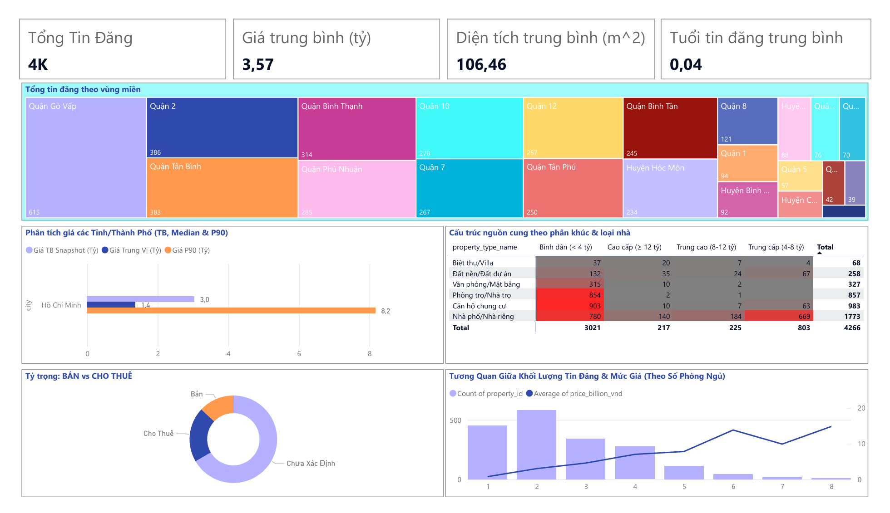
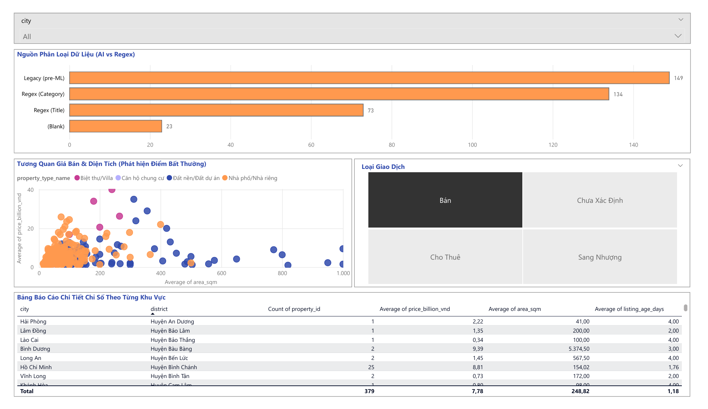
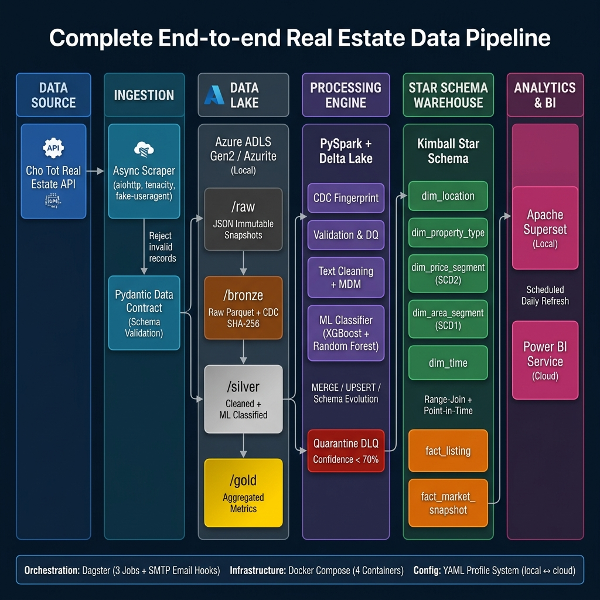
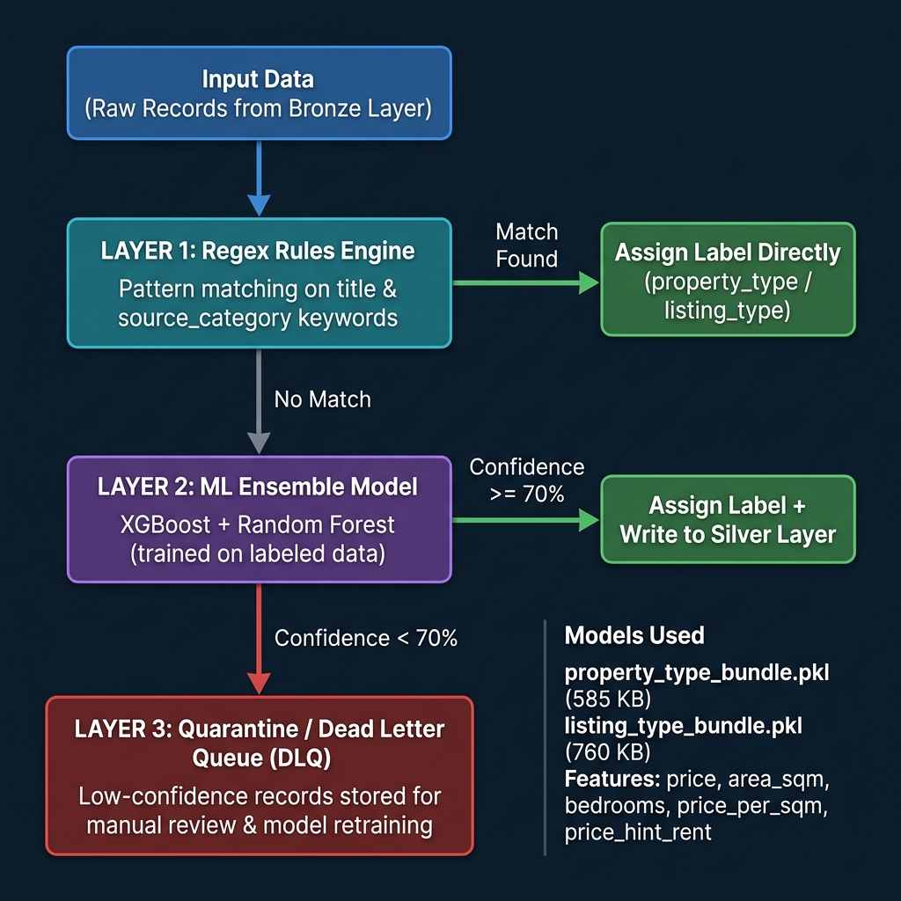
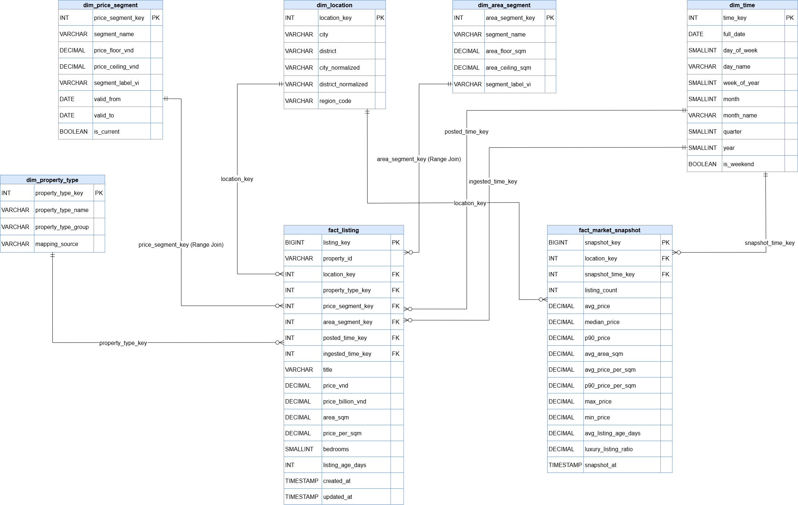
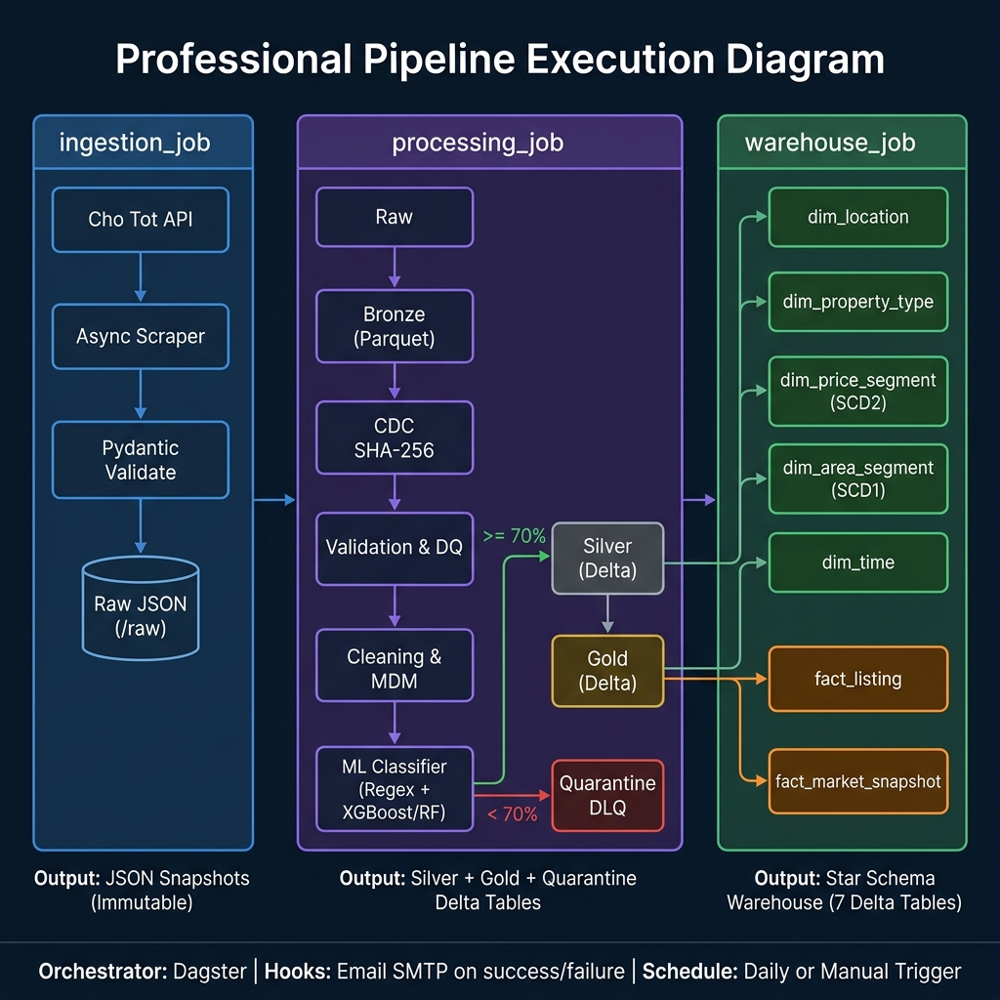

# Real Estate Data Platform – End-to-End Data Pipeline

> Hệ thống Data Platform toàn diện thu thập, xử lý, phân tích và trực quan hóa dữ liệu **Bất Động Sản** Việt Nam.

---

## Dashboard Visualization

[](https://app.powerbi.com/groups/me/reports/438069db-1f8e-4b8f-8793-ce7fe60c90b9)

<br>

[](https://app.powerbi.com/groups/me/reports/438069db-1f8e-4b8f-8793-ce7fe60c90b9)

---

## Tech Badges


---

## 1. Tổng quan Dự án

Dự án xây dựng một **Data Platform End-to-End** — từ khâu thu thập dữ liệu thô đến phân tích kinh doanh — cho thị trường bất động sản Việt Nam.

Hệ thống tuân thủ tư tưởng **Modern Data Stack**, áp dụng kiến trúc **Medallion Architecture** đầy đủ:
`Raw (Immutable) → Bronze → Silver (kèm Quarantine DLQ) → Gold → Star Schema Warehouse → BI Dashboard`

### Các đặc tính Production-ready:
| Đặc tính | Mô tả |
|---|---|
| **Idempotent & Replay-safe** | CDC Fingerprint (SHA-256) đảm bảo chạy lại nhiều lần không tạo dữ liệu trùng lặp |
| **Config-driven** | Toàn bộ cấu hình tách biệt khỏi logic qua `YAML` + `.env`. Chuyển Local ↔ Azure Cloud không cần sửa code |
| **Hybrid ML + DLQ** | 3 lớp phân loại: Regex → XGBoost/Random Forest → Quarantine (Dead Letter Queue) |
| **Kimball Star Schema** | Warehouse chuẩn ngành với SCD Type 1 & Type 2 |
| **Cloud-to-Cloud BI** | Power BI Service kết nối thẳng ADLS Gen2 qua Account Key, Scheduled Refresh tự động |
| **Observability & Alerting** | Dagster Hooks gửi Email SMTP tự động khi pipeline thành công hoặc thất bại |
| **Data Contracts** | Pydantic v2 validate schema tại ingestion layer, chặn dữ liệu không hợp lệ từ đầu nguồn |

---

## 2. Tech Stack Chi tiết

| Công cụ / Thư viện | Phiên bản | Vai trò |
|---|---|---|
| **Python** | 3.11+ | Ngôn ngữ chính toàn bộ hệ thống |
| **PySpark** | 3.5.0 | Distributed ETL: Cleaning, Dedup, Transform, Aggregation |
| **Delta Lake** | 3.1.0 | ACID table format: MERGE/UPSERT, Schema Evolution, Time Travel |
| **Dagster** | 1.8.12 | Orchestration: Software-Defined Assets, Observability |
| **Azure ADLS Gen2** | — | Kho lưu trữ Lakehouse chính: Bronze/Silver/Gold/Warehouse |
| **Azure Databricks** | 14.3.1 | Cloud compute cluster cho PySpark qua Databricks Connect |
| **Azurite** | Docker | Giả lập Azure Blob Storage offline cho môi trường Local |
| **azure-storage-blob** | 12.19.0 | Python SDK tương tác với Azure / Azurite |
| **aiohttp** | 3.9.5 | Async HTTP scraper với batching và semaphore anti-ban |
| **tenacity** | 9.0.0 | Retry logic với Exponential Backoff chống lỗi mạng |
| **fake-useragent** | 1.5.1 | Rotate User-Agent tự động tránh bị API ban |
| **Pydantic** | 2.7.1 | Data Contract & Schema Validation tại ingestion layer |
| **scikit-learn** | 1.6.1 | Random Forest model phân loại `property_type` & `listing_type` |
| **XGBoost** | 2.1.2 | Gradient Boosting model (ensemble với Random Forest) |
| **joblib** | 1.4.2 | Serialize/Deserialize model `.pkl` + `lru_cache` tăng tốc |
| **Power BI Service** | Cloud | Cloud BI: Scheduled Refresh tự động, không cần Gateway |
| **Apache Superset** | Docker | Local BI Dashboard kết nối Gold Layer qua DuckDB |
| **Docker Compose** | — | Container hóa toàn bộ hạ tầng local (Dagster, Superset, Azurite) |
| **PyYAML** | 6.0.2 | Parse file config `base.yaml` / `local.yaml` / `local.azure.yaml` |
| **PyArrow** | 17.0.0 | Đọc/ghi Parquet nhanh, tương thích Delta Lake |
| **pytest** | 8.1.1 | Unit testing cho các module PySpark |

---

## 3. Luồng Dữ liệu (Data Pipeline Architecture)



---

## 4. Hệ thống Phân loại ML (Hybrid Classification)

Mô-đun `ml_classifier.py` là "Bộ não AI" của pipeline, được gọi sau khi Regex thất bại.

### Luồng 3 lớp:



### Các Model đã train (trong `models/`):
| File | Mục đích | Kích thước |
|---|---|---|
| `property_type_bundle.pkl` | Phân loại loại BĐS (Villa, Căn hộ, Đất...) | ~585 KB |
| `listing_type_bundle.pkl` | Phân loại Bán / Cho thuê | ~760 KB |
| `training_data_final.csv` | Dữ liệu huấn luyện (đã label) | ~222 KB |

### Feature Engineering (từ `colab_compare_models_v3.py`):
- **Numeric**: `price`, `area_sqm`, `bedroom_count`, `price_per_sqm`
- **Boolean regex**: `price_hint_rent` (tìm "triệu/tháng" trong title)
- **Text**: `title`, `source_category`, `city`, `district`
- **Encoding**: `LabelEncoder` cho categorical features

---

## 5. Star Schema Warehouse (Kimball)

### Sơ đồ ERD (Entity Relationship Diagram)



### Chi tiết bảng:
| Bảng | Loại | Mô tả |
|---|---|---|
| `dim_location` | Dimension | Thành phố, quận/huyện, vùng miền |
| `dim_property_type` | Dimension | Loại hình BĐS (Villa, Căn hộ, Nhà phố...) |
| `dim_price_segment` | Dimension SCD2 | Phân khúc giá có theo dõi lịch sử (`valid_from`, `valid_to`, `is_current`) |
| `dim_area_segment` | Dimension SCD1 | Phân khúc diện tích (Ghi đè, không theo dõi lịch sử) |
| `dim_time` | Dimension | Phân cấp ngày/tháng/quý/năm |
| `fact_listing` | Fact | Từng tin đăng BĐS (Point-in-Time Join với SCD2) |
| `fact_market_snapshot` | Fact (Aggregate) | Thống kê giá thị trường hàng ngày |

**Kỹ thuật nổi bật:** 
- **Range-Join**: Nối Fact và Dim bằng khoảng giá trị (`price_floor` <= giá <= `price_ceiling`) thay vì foreign key truyền thống.
- **SCD Type 1 vs Type 2**: `dim_area_segment` dùng SCD1 (luôn lấy định nghĩa mới nhất), trong khi `dim_price_segment` dùng SCD2. Ví dụ: Năm 2022 nhà "Cao cấp" là >10 tỷ, năm 2024 lạm phát nên "Cao cấp" là >15 tỷ. SCD2 lưu cả 2 khoảng thời gian để bảng Fact năm 2022 join đúng với định nghĩa cũ, Fact năm 2024 join định nghĩa mới!

---

## 6. Cấu trúc Thư mục

```text
├── src/                            # Core Business Logic
│   ├── config.py                   # Config-driven settings (YAML + .env merge)
│   ├── logging_config.py           # Centralized logging setup
│   ├── scraper/                    # Ingestion layer
│   │   ├── api_client.py           # Async HTTP client (aiohttp, semaphore, retry)
│   │   └── normalizer.py           # Pydantic RealEstateAd schema + normalize()
│   ├── processing/                 # PySpark transformation logic
│   │   ├── cleaning.py             # Text norm, MDM city/district mapping, MDM quarantine
│   │   ├── validation.py           # PySpark schema validation + DQ report
│   │   ├── transform.py            # Feature engineering (price_per_sqm, segments...)
│   │   └── ml_classifier.py        # Hybrid Regex -> ML (XGBoost/RF) -> DLQ classifier
│   ├── cdc/                        # Change Data Capture engine
│   │   ├── fingerprint.py          # SHA-256 hash tính record fingerprint
│   │   └── state_store.py          # Persist & compare fingerprint state
│   ├── warehouse/                  # Star Schema builders
│   │   ├── dim_builders.py         # 5 Dimension table builders (SCD 1 & 2)
│   │   ├── fact_builders.py        # 2 Fact table builders (Range Join)
│   │   ├── delta_io.py             # Delta Lake read/write helpers
│   │   └── schema.py               # PySpark schema definitions
│   ├── lakehouse/                  # Delta Lake writer (Merge/Upsert/Overwrite)
│   └── storage/                    # Azure Blob / Azurite client abstraction
│
├── pipelines/                      # Dagster Orchestration Layer
│   ├── definitions.py              # Dagster Definitions entrypoint
│   ├── jobs.py                     # 3 Jobs: ingestion_job, processing_job, warehouse_job
│   ├── hooks.py                    # Email alerts: success_hook + failure_hook (SMTP)
│   ├── resources.py                # settings_resource, storage_resource, spark_resource
│   ├── config/                     # Profile YAML configs
│   │   ├── base.yaml               # Shared default config
│   │   ├── local.yaml              # Local Azurite profile
│   │   └── local.azure.yaml        # Azure Cloud profile
│   └── ops/                        # Dagster Ops (atomic pipeline steps)
│       ├── ingestion_ops.py        # op_ingest_and_store_raw
│       ├── cdc_ops.py              # op_detect_changes (CDC fingerprint)
│       ├── processing_ops.py       # op_validate, op_clean, op_transform_silver/gold...
│       └── warehouse_ops.py        # op_build_dimensions, op_build_fact_listing...
│
├── models/                         # Pre-trained ML Models
│   ├── property_type_bundle.pkl    # XGBoost/RF model cho property_type
│   ├── listing_type_bundle.pkl     # XGBoost/RF model cho listing_type
│   └── training_data_final.csv     # Training dataset (đã gán nhãn)
│
├── notebooks/                      # Jupyter Notebooks (EDA, model training)
├── colab_prepare_data_v3.py        # Script chuẩn bị data cho training
├── colab_compare_models_v3.py      # Script so sánh XGBoost vs Random Forest
├── docker/                         # Custom Docker images
│   ├── dagster/Dockerfile
│   └── superset/Dockerfile
├── docs/                           # Tài liệu dự án
│   └── images/                     # [CHÈN powerbi_dashboard.png vào đây]
├── tests/                          # Unit tests (pytest + PySpark)
├── scripts/                        # Utility & debug scripts
├── .env                            # Secrets (gitignored)
├── .env.example                    # Template cho local setup
├── .env.cloud                      # Azure Cloud credentials (gitignored)
├── docker-compose.yml              # Local infrastructure orchestration
├── requirements.txt                # Python dependencies
└── workspace.yaml                  # Dagster workspace entrypoint
```

---

## 7. Hướng dẫn Chạy Local

### Bước 1: Chuẩn bị môi trường
```bash
# Clone repo
git clone https://github.com/l-tkphu01/Real_Estate_Data_Platform.git
cd Real_Estate_Data_Platform

# Cài Python dependencies
pip install -r requirements.txt

# Copy và chỉnh file .env
cp .env.example .env
```

### Bước 2: Khởi động Infrastructure
```bash
docker-compose up -d --build
```
Sau khi chạy, 4 services sẽ hoạt động:
| Service | URL | Mô tả |
|---|---|---|
| `real-estate-dagster-web` | http://localhost:3000 | Dagster Orchestrator UI |
| `real-estate-dagster-daemon` | — | Background scheduler & sensor |
| `real-estate-azurite` | Port 10000 | Azure Blob Storage local emulator |
| `real-estate-superset` | http://localhost:8088 | BI Dashboard |

### Bước 3: Chạy Pipeline End-to-End (Dagster UI)
Truy cập `http://localhost:3000` → chọn tab **Jobs** → chạy lần lượt 3 jobs theo thứ tự:



| Job | Các bước thực thi | Output |
|---|---|---|
| **ingestion_job** | Gọi API Chợ Tốt → Pydantic validate schema → Lưu JSON vào `/raw` | Raw JSON snapshots (immutable) |
| **processing_job** | Raw → Bronze (Parquet) → CDC SHA-256 → Validation & DQ → Cleaning & MDM → ML Classification (Regex/XGBoost/RF) → Silver → Gold | Silver Delta (cleaned), Gold Delta (aggregated), Quarantine DLQ |
| **warehouse_job** | Silver → Build 5 Dimension tables (SCD1 & SCD2) → Build `fact_listing` (Range Join) + `fact_market_snapshot` (Daily Aggregate) | Star Schema Warehouse (7 Delta tables) |

### Bước 4: Xem kết quả
- **Dagster UI**: Xem lineage, logs, DQ report
- **Superset**: http://localhost:8088 (admin/admin) -> Kết nối Gold Layer
- **Power BI**: Kết nối ADLS Gen2 qua Account Key để xem Cloud dashboard

---

## 8. Triển khai Azure Cloud

### Các dịch vụ Azure đã khởi tạo:
| Dịch vụ Azure | Cấu hình | Mục đích |
|---|---|---|
| **Storage Account** | `strealestatedatalake` | Lưu trữ toàn bộ Data Lake |
| **ADLS Gen2** | Hierarchical Namespace: ON | Phân cấp thư mục `/bronze`, `/silver`, `/gold`, `/warehouse` |
| **Azure Databricks** | Cluster + Databricks Connect 14.3.1 | Cloud compute chạy PySpark ETL |
| **Power BI Service** | My Workspace | Cloud BI với Scheduled Daily Refresh |

### Chuyển Local -> Azure (không đổi code):
```env
# Chỉnh file .env.cloud
APP_PROFILE=local.azure
AZURE_ENDPOINT=                          # Để trống = dùng ADLS thật
AZURE_STORAGE_ACCOUNT=strealestatedatalake
AZURE_STORAGE_KEY=<your_account_key>
AZURE_CONTAINER=datalake
DATABRICKS_HOST=https://adb-xxx.azuredatabricks.net/
DATABRICKS_TOKEN=<your_token>
DATABRICKS_CLUSTER_ID=<cluster_id>
```
Hệ thống tự động phát hiện `APP_PROFILE=local.azure` và dùng đường dẫn `abfss://` thay vì ổ cứng local.

### Power BI Scheduled Refresh:
- Kết nối: ADLS Gen2 -> Power BI Service qua **Account Key Authentication**
- Refresh: Daily tại 07:00 AM (UTC+7) — **không cần On-premises Gateway**
- Report URL: `https://app.powerbi.com/groups/me/reports/438069db-1f8e-4b8f-8793-ce7fe60c90b9`

---

## 9. Hệ thống Config-Driven

### Thứ tự merge config:
```
base.yaml  ->  {APP_PROFILE}.yaml  ->  .env (override)
```

### Các biến quan trọng trong `.env`:
| Variable | Default | Mô tả |
|---|---|---|
| `APP_PROFILE` | `local` | Profile YAML (`local`, `local.azure`) |
| `MAX_PAGES` | `50` | Số trang API cào (50 trang ~ 1000 tin) |
| `PAGES_PER_BATCH` | `5` | Số trang / batch (anti-ban) |
| `BATCH_DELAY_SECONDS` | `2.0` | Delay (giây) giữa các batch |
| `SEMAPHORE_SIZE` | `3` | Max concurrent HTTP requests |
| `AZURE_ENDPOINT` | `http://127.0.0.1:10000/...` | Để trống = dùng Azure thật |
| `SMTP_HOST` | `smtp.gmail.com` | Host gửi email alert |
| `EMAIL_ALERTS_ENABLED` | `false` | Bật/tắt email alert từ Dagster Hooks |

---

## 10. Điểm Nổi bật Kỹ thuật (Technical Highlights)

| # | Kỹ thuật | Ý nghĩa |
|---|---|---|
| 1 | **CDC Fingerprinting (SHA-256)** | Chỉ xử lý bản ghi thật sự mới/thay đổi, tránh tốn compute |
| 2 | **Hybrid ML + DLQ 3 lớp** | Pipeline không sụp đổ khi gặp dữ liệu dị thường |
| 3 | **XGBoost & Random Forest Ensemble** | 2 model song song nâng cao độ chính xác phân loại BĐS |
| 4 | **Kimball Star Schema + SCD 1&2** | Chuẩn ngành cho Data Warehouse, tối ưu query BI |
| 5 | **Range-Join Dimension** | Gán phân khúc giá/diện tích linh hoạt theo khoảng giá trị |
| 6 | **Config-driven + Profile YAML** | Viết code 1 lần, chạy ở mọi môi trường |
| 7 | **Cloud-to-Cloud BI** | ADLS Gen2 -> Power BI tự động refresh không cần Gateway |
| 8 | **MDM City/District Mapping** | Chuẩn hóa địa danh đa dạng (TP.HCM / Hồ Chí Minh / HCMC) |
| 9 | **Dagster Hooks Email SMTP** | Proactive alerting khi job fail hoặc succeed |
| 10 | **lru_cache Model Loading** | Load model `.pkl` một lần, cache trong memory, tăng tốc 10x |

